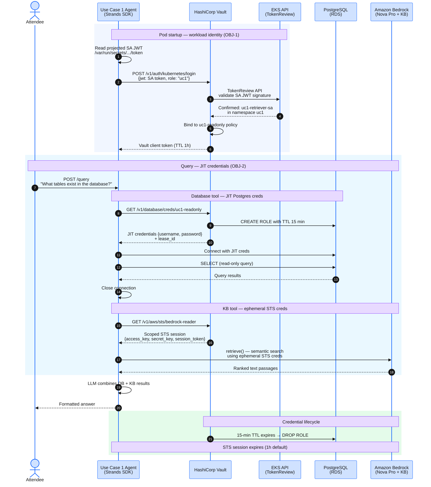

## Overview

This module walks through the end-to-end credential and data flow for Use Case 1. No user identity is involved — the agent authenticates purely as a **workload** using its Kubernetes ServiceAccount JWT. Every credential is just-in-time, short-lived, and automatically revoked.

## Request Flow

:::expand{header="Step-by-step breakdown — numbered steps in the diagram explained"}

1. At pod startup, the agent reads its projected ServiceAccount JWT from the Kubernetes token volume mount (`/var/run/secrets/kubernetes.io/serviceaccount/token`).
2. The agent's `VaultClient.login()` method POSTs the SA JWT to Vault's Kubernetes auth endpoint with `role: "uc1"`.
3. Vault calls the EKS TokenReview API to validate the JWT signature and confirm the ServiceAccount identity (`uc1-retriever-sa` in namespace `uc1`).
4. Vault issues a client token bound to the `uc1-readonly` policy (TTL 1 hour). This token is cached for the pod's lifetime.
5. When a query arrives, the agent calls `query_database()` — which fetches JIT Postgres credentials from Vault's database secrets engine (`database/creds/uc1-readonly`). Vault creates an ephemeral Postgres role with a 15-minute TTL.
6. The agent connects to RDS with the JIT credentials, executes the read-only query, and closes the connection.
7. For knowledge base retrieval, the agent calls `retrieve_from_knowledge_base()` — which fetches scoped STS credentials from Vault's AWS secrets engine (`aws/sts/bedrock-reader`). Vault generates a temporary AWS session with `bedrock:InvokeModel` + `bedrock:Retrieve` permissions only.
8. The agent calls the Bedrock Knowledge Base `retrieve()` API using the ephemeral STS session.
9. The Strands LLM combines database and knowledge base results into a formatted answer.
10. After 15 minutes, Vault automatically revokes the Postgres role (`DROP ROLE`). The STS session expires at its own TTL.

:::

## Key security properties

| Property | How it works in Use Case 1 |
|---|---|
| **No standing credentials** (OBJ-2) | The pod has no `AWS_ACCESS_KEY_ID`, no `PGPASSWORD`, no `.aws/credentials` file. Every credential is fetched from Vault per-invocation. |
| **Workload identity only** (OBJ-1) | The Vault Kubernetes auth role `uc1` is bound to `uc1-retriever-sa` in namespace `uc1`. No other ServiceAccount can obtain the `uc1-readonly` policy. |
| **Read-only enforcement** | The Vault database role `uc1-readonly` issues `GRANT SELECT` only. Even if the agent attempted `INSERT`, Postgres would reject it. |
| **Network isolation** (ENFC-03) | NetworkPolicy restricts egress to Vault (8200/TCP), RDS (5432/TCP), Bedrock (443/TCP), and DNS only. |
| **Audit correlation** (OBJ-5) | Vault audit log records the K8s auth login (SA identity) and every `database/creds` issuance (lease_id) — correlating workload identity to data access. |
