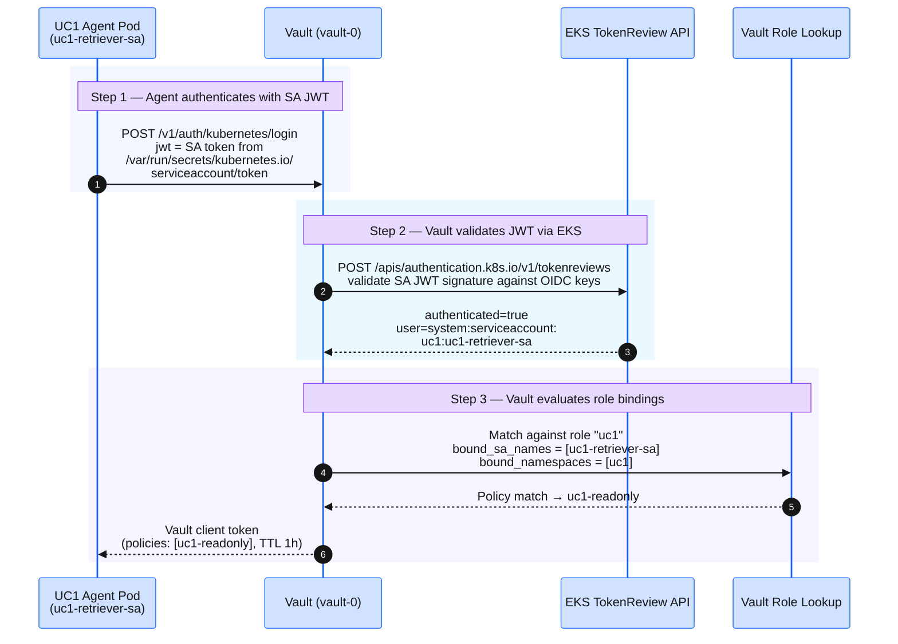

## Overview

The Vault Kubernetes auth method, database secrets engine role, AWS secrets engine role, and access policy for Use Case 1 were all configured by the `vault_config` Terraform module in the Deploy Foundation module (applied via local Terraform (`terraform -chdir=infrastructure apply`)). **You do not need to reconfigure anything in this module.**

This page explains what was configured and why — understanding the Vault trust chain is essential before you observe credential issuance in the next module.

## Step 1 — Inspect the Vault role binding

Point the `vault` CLI at Vault and authenticate with the root token so the reads below are permitted (without `VAULT_TOKEN` the CLI sends no credential and Vault returns `403 permission denied`). One paste — kills any prior port-forward, opens a fresh one, exports `VAULT_ADDR` + `VAULT_TOKEN`, and prints the Web UI URL + token for the browser-side step further down:

```bash
pkill -f "kubectl port-forward -n vault svc/vault 8200:8200" 2>/dev/null; \
  kubectl port-forward -n vault svc/vault 8200:8200 >/dev/null 2>&1 & \
  sleep 2 && \
  export VAULT_ADDR=http://localhost:8200 && \
  export VAULT_TOKEN=$(jq -r '.root_token' ~/vault-init.json) && \
  echo && echo "Vault Web UI: $VAULT_ADDR/ui" && echo "Root token:   $VAULT_TOKEN"
```

To follow along in the browser too, open the **Vault Web UI** URL printed above, leave **Token** selected as the auth method, and paste the printed root token.

Read the Kubernetes auth role that binds `uc1-retriever-sa` to the `uc1-readonly` policy:

```bash
vault read auth/kubernetes/role/uc1
```

Expected output:

```
Key                                         Value
---                                         -----
alias_name_source                           serviceaccount_name
bound_service_account_names                 [uc1-retriever-sa]
bound_service_account_namespaces            [uc1]
token_max_ttl                               2h
token_policies                              [uc1-readonly]
token_ttl                                   1h
token_type                                  default
```

Vault prints several more fields than the ones shown here; these are the ones that matter.

Key observations:

- `bound_service_account_names` is `[uc1-retriever-sa]` — only this SA in namespace `uc1` can obtain this role.
- `token_policies` is `[uc1-readonly]` — the Vault token issued after login is scoped to this policy only.
- `token_ttl` is 1 hour — the Vault session (not the database credential) lifetime.

## Step 2 — Inspect the uc1-readonly policy

```bash
vault policy read uc1-readonly
```

Expected output:

```hcl
path "database/creds/uc1-readonly" {
  capabilities = ["read"]
}

path "aws/sts/bedrock-reader" {
  capabilities = ["read", "update"]
}

path "auth/token/lookup-self" {
  capabilities = ["read"]
}

path "sys/leases/renew" {
  capabilities = ["update"]
}
```

Each policy path serves a specific purpose:

| Path | Capabilities | Purpose |
|---|---|---|
| `database/creds/uc1-readonly` | `read` | Issue JIT Postgres read-only credentials (TTL 15 min) |
| `aws/sts/bedrock-reader` | `read`, `update` | Generate a scoped AWS STS session for Bedrock Knowledge Base access |
| `auth/token/lookup-self` | `read` | Agent can inspect its own Vault token TTL and policies — used for introspection and token renewal decisions |
| `sys/leases/renew` | `update` | Renew active credential leases before TTL expiry if the agent query takes longer than expected |

Notice what is **not** in the policy:

- No `database/creds/uc3-refund-writer` — Use Case 3 credentials are completely out of scope for this policy.
- No `aws/iam/*` — the agent cannot create or modify IAM resources.
- No `sys/mounts` — the agent cannot create new secrets engine mounts.

## Step 3 — Verify the Kubernetes auth method is enabled

```bash
vault auth list
```

Look for the `kubernetes/` mount in the output:

```
Path           Type          Description
----           ----          -----------
kubernetes/    kubernetes    n/a
token/         token         token based credentials
```

Verify the Kubernetes auth configuration points to the EKS cluster:

```bash
vault read auth/kubernetes/config
```

The `kubernetes_host` field should show the EKS API server endpoint. This is the address Vault calls when validating an incoming SA JWT via the Kubernetes TokenReview API.

## Step 4 — Verify the database secrets engine role

```bash
vault read database/roles/uc1-readonly
```

Expected output:

```
Key                      Value
---                      -----
db_name                  workshop-pg
default_ttl              15m
max_ttl                  30m
creation_statements      ["CREATE ROLE \"{{name}}\" WITH LOGIN PASSWORD '{{password}}' VALID UNTIL '{{expiration}}';"
                          "GRANT SELECT ON ALL TABLES IN SCHEMA public TO \"{{name}}\";"
                          "ALTER DEFAULT PRIVILEGES IN SCHEMA public GRANT SELECT ON TABLES TO \"{{name}}\";"]
revocation_statements    ["REVOKE ALL PRIVILEGES ON ALL TABLES IN SCHEMA public FROM \"{{name}}\";"
                          "REVOKE ALL PRIVILEGES ON ALL SEQUENCES IN SCHEMA public FROM \"{{name}}\";"
                          "DROP ROLE IF EXISTS \"{{name}}\";"]
```

The 15-minute TTL means each Postgres credential issued to the agent is valid for exactly 15 minutes. After expiry, Vault executes the `revocation_statements` to drop the dynamically created role from Postgres automatically.

## Step 5 — Registry identity: the `uc1-agent` registration

Use Case 1 keeps **Kubernetes auth** — its agent presents a ServiceAccount JWT, not an OAuth token — but it is *also* registered in the Vault **Agent Registry** so the agent carries a first-class, named identity in Vault rather than an anonymous entity. Read the registration:

```bash
vault read agent-registry/registration/display-name/uc1-agent
```

Expected (key fields):

```
Key                               Value
---                               -----
ceiling_policies                  [uc1-ceiling]
display_name                      uc1-agent
optional_authorization_details    false
owner                             uc1-retriever-service
```

Two things distinguish Use Case 1 from Use Cases 2 and 3:

- **The registration gives Use Case 1 a verifiable identity, not an extra enforcement layer.** Because Use Case 1 authenticates with Kubernetes auth — it presents no OAuth `act.sub` actor claim — the registration's `ceiling_policies` are **inert for enforcement**. A registered agent's own ceiling does not self-restrict without an actor resolving it on-behalf-of a human. Use Case 1's one enforcing layer is the `uc1-readonly` Kubernetes-auth policy you inspected in Steps 1–2.
- **Enforcement layers for Use Case 1 = one** (the `uc1-readonly` policy floor). Use Cases 2 and 3 authenticate on behalf of a human through the OAuth resource server and layer **three** enforcing controls (human baseline ∩ agent ceiling ∩ per-request scope); Use Case 1 does not, and does not need to — it is a workload reading its own least-privilege data.

:::expand{header="Agent Developer Track — hvac login flow and token vs credential TTL"}

When the agent calls `VaultClient.login()` at pod startup, the following exchange occurs:

```
Agent → Vault:  POST /v1/auth/kubernetes/login
                Body: { "role": "uc1", "jwt": "<SA-token>" }

Vault → EKS:    POST /apis/authentication.k8s.io/v1/tokenreviews
                Body: { "spec": { "token": "<SA-token>" } }

EKS → Vault:    { "status": { "authenticated": true,
                               "user": { "username": "system:serviceaccount:uc1:uc1-retriever-sa" } } }

Vault → Agent:  { "auth": { "client_token": "<vault-token>",
                              "policies": ["uc1-readonly"],
                              "lease_duration": 3600 } }
```

The returned `client_token` has a TTL of **1 hour** (the Vault token TTL, set on the Kubernetes auth role).

When the agent then calls `client.secrets.database.generate_credentials("uc1-readonly")`, a **separate** JIT credential is issued with a TTL of **15 minutes** (set on the database secrets engine role). These are two different TTL clocks:

| Entity | TTL | What it controls |
|---|---|---|
| Vault token (`client_token`) | 1 hour | How long the agent can make Vault API calls before needing to re-authenticate |
| Postgres JIT credential | 15 minutes | How long the specific `username`/`password` pair is valid for Postgres connections |

The agent refreshes JIT credentials on each incoming HTTP request — not when the Vault token expires. This means you see a new Vault audit log entry for each `/query` call.
:::

:::expand{header="Platform/Security Track — Kubernetes auth trust chain diagram"}

The Kubernetes auth trust chain has four participants:



Steps 1–3 happen inside the cluster. The EKS TokenReview API endpoint is the **trust anchor** — Vault trusts whatever EKS says about the SA JWT. This is why:

- There is no Vault credential pre-seeded in the pod — the SA JWT IS the credential.
- Renaming the SA in Kubernetes without updating `bound_service_account_names` in Vault immediately breaks authentication — the binding is strict.
- The NetworkPolicy allows 8200/TCP to Vault from the `uc1` namespace — without this rule the login POST cannot reach Vault.
:::
